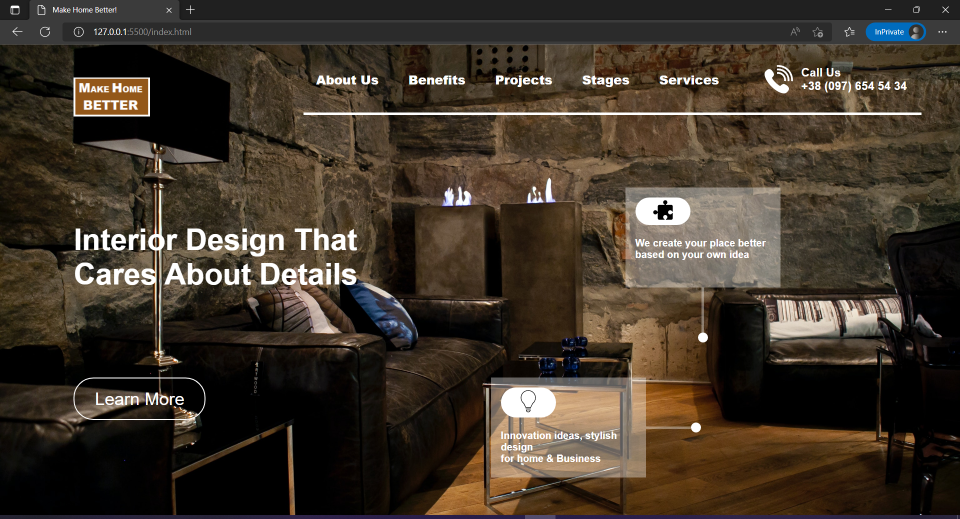

# Project-10 - An-Interior-Designer's-Landing-Page

## Description:

> An Interior Designer's website's Landing page which will be the first web page that the potential client will see when he/she reaches designer's website.

# 

**Landing-Page-Images:**

#

## What I have learnt while making this project?

> This project took quite some time as in this project I had to write the HTML as well and decide on the DOM structure of the page, also had to find & decide on the proper Background image and find free to use icon svg files from internet. I also got to learn some small things about svg files like "fill" property. In addition to this, I also tried my best to make the Landing page look exactly as it was looking in the shared image of the Landing page or make it look even better. Also similar to previous projects, this project also helped me get better with using HTML & CSS to create stunning Landing pages without the use of any external libraries like Bootstrap.

#

## Time taken to complete this project:
> Around 5hrs.

#

## See this project in action at below link:

**[Click to redirect to Project-10](https://p10-make-home-better.netlify.app/)**

#

## Developed by:

**Sidharth Pandey**

**[Contact Me](mailto:sidp0008@gmail.com)**

#